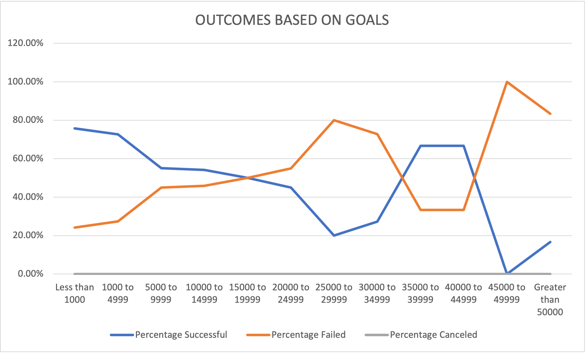

# Kickstarting with Excel

## Overview of Project

*  The purpose of this project was to display and interpret Kickstarter data as the outcomes of theater kickstarters based on their launch dates as well as the outcomes of kickstarter plays based on their fundraising goals. The goal is help our friend Louise have a frame of reference for how successful her fundraising efforts were for her play *Fever*.

## Analysis and Challenges

### Analysis of Outcomes Based on Launch Date

		
In the first part of my analysis I extracted the years from the launch dates of the various Kickstarter projects and created a pivot table in order to get a clearer view of the data. I then made the pivot table filterable by years as well as parent category in order to sort the project by the Theater category, which is what was sought. A line chart was then created with the months at launch as the x-axis and the count of outcomes as the y-axis. Three lines representing success, failure, and cancellation of the Kickstarter projects are displayed along the chart to view annual patterns.

### Analysis of Outcomes Based on Goals

		In the second part of my analysis I wanted to gauge what percentage of Kickstarter plays met or failed their goals and what perecent were canceled. By using the `=COUNTIFS` function in Excel I was able to tally up the total number of failed, successful, and canceled plays and further divvied them up into more narrow goal ranges; starting from less than $1,000, and going by increments of about $5,000, until reaching greater than $50,000. A line graph was then constructed to show the percentages of outcomes listed along the y-axis and the goal-funding ranges on the x-axis. The end result is a chart that shows what level of failure or success certain kickstarters had depending on their inital fundraising goals.
		
### Challenges and Difficulties Encountered
Most of the difficulty in constructing the above analysis was in filtering the outcomes based on goals in Excel. I had to be diligent in making sure each column was referencing the correct data set in the original kickstarter data. This involved a lot of cross referencing and double checking by filtering through the original Kickstarter data to see if the total numbers resulted in the correct amounts.
## Results

- By looking at the outcomes based on launch date we can conclude that there were many more projects launched in May-June that were successful than any other time period. However, the total number of successes then precipitously declines after June until October where it increases slightly. The number of failures in October, however, also increases to its highest during the year; implying that October may be the worst month for launching a successful theater Kickstarter. We can also see there were zero projects launched in October that were canceled, which is a bit of a peculiarity. 

- The percentage of successful Kickstarters seems to be fairly negatively correlated with fundraising goals; the lower the funding goals, the higher the chance of success. There is however a sudden increase in the percentage of successful Kickstarter plays in the $25,000 to $40,000 bracket, which then declines drastically beyond $40,000. 

- Even with the percentage of successful to failed kickstarters, it's largely difficult to discern how relevant these results are without a set of summary statistics to contextualize these results. 

- We should probably conduct a statistical analysis for each funding bracket in order to gauge expected results as well as the variance of said brackets. 
